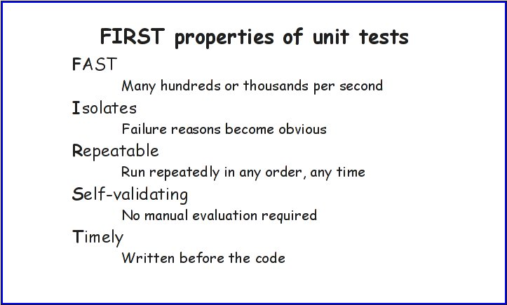

!SLIDE center

# Randomization #

!SLIDE commandline

# Randomization #

## tests are run in a random order ##

	$ ruby test_post.rb
	Run options: --seed 954
	
	# Running tests:
	
	.
	
	Finished tests in 0.000426s, 2347.4178 tests/s, 2347.4178 assertions/s.
	
	1 tests, 1 assertions, 0 failures, 0 errors, 0 skips

!SLIDE commandline

# Randomization #

## use --seed option to rerun tests in same order ##

	$ ruby test_post.rb --seed 954
	Run options: --seed 954
	
	# Running tests:
	
	.
	
	Finished tests in 0.000426s, 2347.4178 tests/s, 2347.4178 assertions/s.
	
	1 tests, 1 assertions, 0 failures, 0 errors, 0 skips

